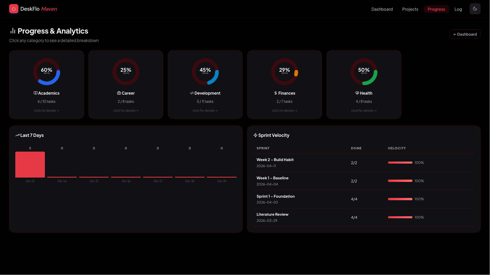
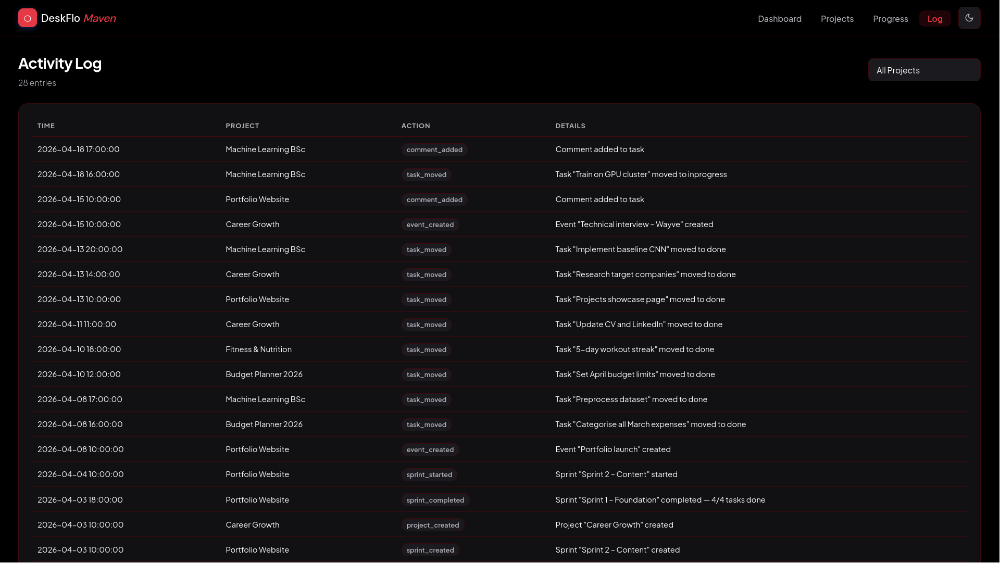

# DeskFlo

**DeskFlo** is a personal project management web app built with Python and Flask. It brings agile-style sprint planning to everyday life — helping you stay on top of your health goals, finances, studies, career, and personal projects all in one place, without needing a team or a SaaS subscription.

---

## Screenshots





---

## Why DeskFlo?

Most people juggle several ongoing goals at once — a fitness routine, a savings plan, a side project, a job search. These usually end up scattered across sticky notes, phone reminders, spreadsheets and half-finished to-do lists. DeskFlo gives all of it a single home with real structure: projects, sprint cycles, prioritised tasks and progress tracking — the same workflow used by software teams, adapted for personal life.

---

## How It Works — The Everyday Flow

### 1. Create a Project for Each Area of Your Life

Start by creating a project for anything you're actively working towards. DeskFlo organises projects into life categories:

| Category | Example Project |
|---|---|
| Health | "2026 Fitness Goals" |
| Finances | "Budget Planner & Savings" |
| Academics | "Final Year Dissertation" |
| Career | "Job Search – Spring 2026" |
| Development | "Portfolio Website" |
| Home | "Flat Renovation" |
| Personal | "Reading List & Hobbies" |

Each project is a self-contained workspace with its own sprints, backlog, tasks and events.

---

### 2. Build Your Backlog

Inside each project, add every task you want to eventually get done — your **backlog**. These sit in a prioritised queue until you're ready to work on them.

Each task has:
- **Title & description** — what needs doing and why
- **Priority** — Low / Medium / High / Critical
- **Label** — Feature, Bug, Improvement, Research, Other
- **Category** — links back to the life area
- **Due date** — when it needs to be done by

You can also add **subtasks** to break complex tasks into smaller steps. A task cannot be marked done until all its subtasks are complete — keeping you honest.

---

### 3. Plan a Sprint

A **sprint** is a focused time-box — typically one or two weeks — where you commit to completing a specific set of tasks. Rather than trying to do everything at once, a sprint forces you to choose what matters right now.

To start a sprint:
1. Create a sprint with a name, goal, start date and end date
2. Select tasks from the backlog and assign them to the sprint
3. Start the sprint — the board goes live

Example sprint goals:
- *"Complete 3 gym sessions and log meals every day this week"*
- *"Submit 5 job applications and prep for system design interview"*
- *"Finish blog MDX integration and dark mode toggle"*

---

### 4. Work the Board

Each active sprint has a **Kanban board** with three columns:

```
[ Todo ]  →  [ In Progress ]  →  [ Done ]
```

Drag and drop tasks across columns as you work through them. The board gives you a live snapshot of where things stand — what's blocked, what's moving, what's done.

Multiple projects can have active sprints running simultaneously, and the **dashboard** shows all of them together in one view.

---

### 5. Review & Complete the Sprint

When the sprint period ends, mark it as complete. DeskFlo automatically:
- Records how many tasks were completed
- Pushes any unfinished tasks back to the backlog
- Logs the sprint velocity (completion rate) for future reference

This review moment is intentional — it's a chance to reflect on what you achieved, what got in the way, and what to carry into the next sprint.

---

### 6. Track Your Progress

The **Progress** page shows you the bigger picture:

- **By category** — completion percentage across Health, Finances, Career, etc.
- **Weekly trend** — a 7-day chart of tasks completed per day
- **Sprint history** — velocity scores for past sprints
- **Productivity streak** — consecutive days where you completed at least one task

Drilling into a category shows a full breakdown by priority, by week, by month and a chronological log of every task you completed — a record of real output over time.

---

### 7. Schedule Events

Attach **events** to any project — interviews, deadlines, appointments, review sessions. Each event has a title, date, time, location and description.

Upcoming events surface on the **dashboard** so nothing sneaks up on you.

---

### 8. The Dashboard — Your Daily Home Screen

The dashboard is designed to be the first thing you open each morning. It shows:

- **Active sprint snapshots** — progress bars and top priority tasks for every running sprint
- **Sprint board** — a live Kanban view across all active sprints combined
- **Upcoming tasks** — sorted by due date and priority
- **Upcoming events** — the next things in your calendar
- **Monthly calendar** — days with tasks due are highlighted; click any day to see what's on
- **Stats strip** — all-time completions, this month's count, current streak, overdue count

---

## Feature Summary

| Feature | What It Does |
|---|---|
| Projects | Organise goals by life area with full CRUD |
| Sprints | Time-boxed work cycles with start/complete lifecycle |
| Kanban board | Drag-and-drop task status across Todo / In Progress / Done |
| Backlog | Prioritised task queue with bulk sprint assignment |
| Tasks & Subtasks | Nested tasks with priority, label, due date, comments |
| Subtask enforcement | Parent task cannot be completed until all subtasks are done |
| Task duplication | Clone tasks to backlog for recurring work |
| Events | Project-linked calendar events with time and location |
| Progress page | Category stats, weekly trend, sprint velocity, streak |
| Activity log | Full timestamped audit trail of every action |
| Calendar view | Monthly due-date map with per-day task drill-down |
| REST API | JSON endpoints for task detail, status moves and calendar data |
| Auto DB init | Database tables are created automatically on first run |

---

## Tech Stack

| Layer | Technology |
|---|---|
| Backend | Python 3, Flask |
| Database | SQLite via Python's built-in `sqlite3` |
| Frontend | Jinja2 templates, vanilla JavaScript |
| Icons | Lucide (local, no CDN dependency) |
| Styling | Custom CSS — no framework |

---

## Project Structure

```
DeskFlo/
├── app.py          Flask routes and REST API endpoints
├── db.py           All database queries and business logic
├── init_db.py      Schema creation — runs automatically on startup
├── seed.py         Demo data loader for development
├── deskflo.db      SQLite database file (auto-created)
├── static/
│   ├── style.css                    All application styles
│   ├── lucide.min.js                Icon library (bundled locally)
│   ├── DeskFlo-demo-screenshots.png Screenshot 1
│   └── DeskFlo-demo-screenshots-2.png Screenshot 2
└── templates/
    ├── base.html                Shared layout and navigation
    ├── index.html               Dashboard
    ├── projects.html            Projects list
    ├── project_detail.html      Project workspace (backlog, sprints, events)
    ├── sprint_board.html        Kanban board
    ├── progress.html            Progress overview
    ├── progress_category.html   Per-category drill-down
    ├── activity_log.html        Audit log
    ├── 404.html                 Not found page
    └── 500.html                 Server error page
```

---

## Getting Started

**1. Clone the repo and install Flask:**

```bash
git clone https://github.com/your-username/deskflo.git
cd deskflo
pip install flask
```

**2. Run the app:**

```bash
python3 app.py
```

The database is created automatically on first run. Open `http://127.0.0.1:5002` in your browser.

**3. (Optional) Load demo data:**

```bash
python3 seed.py
```

This populates the app with sample projects, sprints, tasks, events and activity logs so you can explore all features immediately.

---

## Design Philosophy

DeskFlo is deliberately simple. No user accounts, no cloud sync, no third-party integrations. It runs locally, stores everything in a single SQLite file, and has zero dependencies beyond Flask. The goal is a tool that gets out of your way and helps you focus on actually doing the work.
